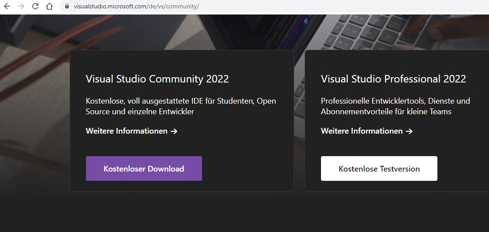
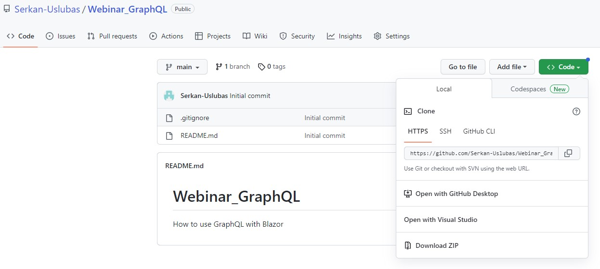

# Webinar_GraphQL

## 00 - Prerequisites

### 01. Download and install "Visual Studio Community 2022"

https://visualstudio.microsoft.com/de/vs/community/




### 02. Download and install SQL Server Management Studio (SSMS)

https://learn.microsoft.com/de-de/sql/ssms/download-sql-server-management-studio-ssms?view=sql-server-ver16

### 03. Clone Repository or download as zip.

https://github.com/Serkan-Uslubas/Webinar_GraphQL




# Session 1: Create a GraphQL Backend Application using Hot Chocolate Framework

## Preparations

**Step 1:**  Copy folder "Webinar_GraphQL\01-Start" as "Webinar_GraphQL\02-Start"

**Step 2:**  Open DF.Webinar.GrahpQL.Backend.sln Solution with Visual Studio.


## Create a new Project

**Step 1:**  Create a new ASP.NET Core Web API project.

**Step 2:**  Set the Project name as "DF.Webinar.GraphQL.Api" and click on the Next button.

**Step 3:**  Choose .NET 7.0 and click on the Create button.

**Step 4:** Add "DF.Webinar.GraphQL.Models" and "DF.Webinar.GraphQL.Database" as Project Reference.

**Step 5:** Delete Controllers folder and WeatherForecast.cs file


**Step 5:**  Install the required NuGet packages. 

For that, you can use the NuGet Package Manager or the Package Manager Console. The required packages are:

```c#

Install-Package HotChocolate.AspNetCore
Install-Package HotChocolate.AspNetCore.Playground
Install-Package HotChocolate.Types
Install-Package HotChocolate.AspNetCore.Voyager
Install-Package HotChocolate.Data
Install-Package HotChocolate.Data.EntityFramework
Install-Package HotChocolate.Types.Analyzers
Install-Package Microsoft.EntityFrameworkCore
Install-Package Microsoft.EntityFrameworkCore.SqlServer
Install-Package Microsoft.EntityFrameworkCore.Tools
Install-Package Microsoft.Extensions.Configuration.FileExtensions
Install-Package Microsoft.Extensions.Configuration.Json

```

## Create the Query Type


**Step 1:**  Create a new folder named "Queries" under the project root. 
  
  This folder will contain all the GraphQL queries for your application.

**Step 2:**  Create a new file named "BookQueries.cs" under the Queries folder. 
  
  This file will contain the GraphQL queries for the Book and Author entity.

**Step 3:**  Add the following code to the BookQueries.cs file:

```csharp

using DF.Webinar.GraphQL.Database;
using DF.Webinar.GraphQL.Models;

namespace DF.Webinar.GraphQL.Api.Queries {
    public class BookQueries {
        
        [UseOffsetPaging(IncludeTotalCount = true)]
        [UseProjection]
        [UseFiltering]
        [UseSorting]
        public IQueryable<Book> GetBooks([ScopedService] AppDbContext context) => context.Books;

        [UseFirstOrDefault]
        [UseProjection]
        [UseFiltering]
        public Book GetBookById(int id, [ScopedService] AppDbContext context) => context.Books.Find(id);
    }
}

```

This code defines two GraphQL queries for the Book entity: GetBooks and GetBookById
1. The **GetBooks** query retrieves all the books in the database and applies filtering and sorting  based on the GraphQL query arguments. 
2. The **GetBookById** query retrieves a book with a specific id. 


## Configure appsettings.json

**Step 1:** In your .NET project, open the appsettings.json file and the DefaultConnection String.

```js
  "ConnectionStrings": {
    "DefaultConnection": "Server=(localdb)\\mssqllocaldb;Database=graphqldb-local;Trusted_Connection=Yes;",
```

Your appsettings.json should now look so:

```js
{
  "Logging": {
    "LogLevel": {
      "Default": "Information",
      "Microsoft.AspNetCore": "Warning"
    }
  },
  "AllowedHosts": "*",
  "ConnectionStrings": {
    "DefaultConnection": "Server=(localdb)\\mssqllocaldb;Database=graphqldb-local;Trusted_Connection=Yes;",
  }

```

## Configure Startup.cs

**Step 1:** In your .NET project, open the Startup.cs file.

**Step 2:** Add the following using statements at the top of the file:

```c#
using DF.Webinar.GraphQL.Api.Queries;
using DF.Webinar.GraphQL.Database;
using HotChocolate.Types.Pagination;
using Microsoft.EntityFrameworkCore;

var builder = WebApplication.CreateBuilder(args);

// Add services to the container.

var configuration = new ConfigurationBuilder()
    .SetBasePath(Directory.GetCurrentDirectory())
    .AddJsonFile("appsettings.json", optional: true, reloadOnChange: true)
    .Build();

builder.Services.AddPooledDbContextFactory<AppDbContext>(opt => {
    opt.UseSqlServer(configuration.GetConnectionString("DefaultConnection"));
    opt.EnableSensitiveDataLogging();
});

builder.Services
    .AddGraphQLServer()
    .RegisterDbContext<AppDbContext>(DbContextKind.Pooled)
    .AddQueryType<BookQueries>()
    .SetPagingOptions(new PagingOptions {
        IncludeTotalCount = true,
        DefaultPageSize = 10,
        MaxPageSize = 10000
    })
    .AddFiltering()
    .AddSorting()
    .AddProjections();

// Configure the HTTP request pipeline.

var app = builder.Build();

app.MapGraphQL();

app.Run();

```