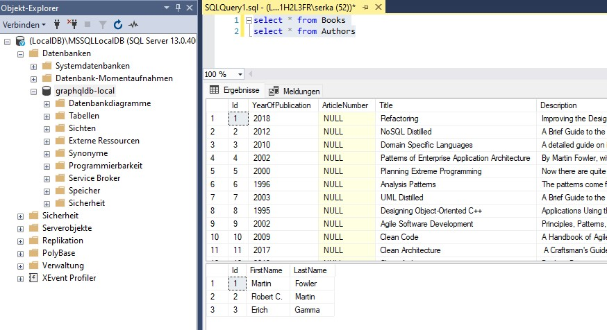

# Webinar_GraphQL

## 00 - Prerequisites

### 01. Download and install "Visual Studio Community 2022"

https://visualstudio.microsoft.com/de/vs/community/


### 02. Download and install SQL Server Management Studio (SSMS)

https://learn.microsoft.com/de-de/sql/ssms/download-sql-server-management-studio-ssms?view=sql-server-ver16

### 03. Clone Repository or download as zip.

https://github.com/Serkan-Uslubas/Webinar_GraphQL


# Session 1: Create a GraphQL Backend Application using Hot Chocolate Framework

## Preparations


**Step 1:**  Copy the content of folder "Webinar_GraphQL\01-Start" into "Webinar_GraphQL\Demo"
**Step 2:**  Open DF.Webinar.GrahpQL.Backend.sln Solution with Visual Studio in the "Webinar_GraphQL\Demo" folder.
**Step 3:**  Set the "DF.Webinar.GraphQL.DatabaseUp" Project as Startup Project
**Step 4:**  In the "package Manager Console type:

```cs
update-database
```

**Step 4:**  Check Database:

```sql
select * from Books
select * from Authors
```



## Create a new Project

**Step 1:**  Add new Project: New ASP.NET Core Web API project.

**Step 2:**  Set the Project name as "DF.Webinar.GraphQL.Api" and click on the Next button.

**Step 3:**  Choose .NET 7.0 and click on the Create button.

**Step 4:** Add Project References:
- DF.Webinar.GraphQL.Models 
- DF.Webinar.GraphQL.Database

**Step 5:** If exists: Delete Controllers folder and WeatherForecast.cs file


**Step 5:**  Install the required NuGet packages. 

For that, you can use the NuGet Package Manager or the Package Manager Console. The required packages are:
- Choose "DF.Webinar.GraphQL.Api" as default Project in Package Manager Console.

```c#

Install-Package HotChocolate.AspNetCore
Install-Package HotChocolate.AspNetCore.Playground
Install-Package HotChocolate.Types
Install-Package HotChocolate.AspNetCore.Voyager
Install-Package HotChocolate.Data
Install-Package HotChocolate.Data.EntityFramework
Install-Package HotChocolate.Types.Analyzers
Install-Package Microsoft.EntityFrameworkCore
Install-Package Microsoft.EntityFrameworkCore.SqlServer
Install-Package Microsoft.EntityFrameworkCore.Tools
Install-Package Microsoft.Extensions.Configuration.FileExtensions
Install-Package Microsoft.Extensions.Configuration.Json

```

**Step 6:**  Open the DF.Webinar.GraphQL.Api Project file and confirm if all packages are installed and Projects are referenced.

```c#
<Project Sdk="Microsoft.NET.Sdk.Web">

  <PropertyGroup>
    <TargetFramework>net7.0</TargetFramework>
    <Nullable>enable</Nullable>
    <ImplicitUsings>enable</ImplicitUsings>
  </PropertyGroup>

  <ItemGroup>
    <PackageReference Include="HotChocolate.AspNetCore" Version="13.0.5" />
    <PackageReference Include="HotChocolate.AspNetCore.Playground" Version="10.5.5" />
    <PackageReference Include="HotChocolate.AspNetCore.Voyager" Version="10.5.5" />
    <PackageReference Include="HotChocolate.Data" Version="13.0.5" />
    <PackageReference Include="HotChocolate.Data.EntityFramework" Version="13.0.5" />
    <PackageReference Include="HotChocolate.Types" Version="13.0.5" />
    <PackageReference Include="HotChocolate.Types.Analyzers" Version="13.0.5" />
    <PackageReference Include="Microsoft.EntityFrameworkCore" Version="7.0.3" />
    <PackageReference Include="Microsoft.EntityFrameworkCore.SqlServer" Version="7.0.3" />
    <PackageReference Include="Microsoft.EntityFrameworkCore.Tools" Version="7.0.3">
      <PrivateAssets>all</PrivateAssets>
      <IncludeAssets>runtime; build; native; contentfiles; analyzers; buildtransitive</IncludeAssets>
    </PackageReference>
    <PackageReference Include="Microsoft.Extensions.Configuration.FileExtensions" Version="7.0.0" />
    <PackageReference Include="Microsoft.Extensions.Configuration.Json" Version="7.0.0" />
  </ItemGroup>

  <ItemGroup>
    <ProjectReference Include="..\DF.Webinar.GraphQL.Database\DF.Webinar.GraphQL.Database.csproj" />
    <ProjectReference Include="..\DF.Webinar.GraphQL.Models\DF.Webinar.GraphQL.Models.csproj" />
  </ItemGroup>

</Project>

```
## Create the Query Type


**Step 1:**  Create a new folder named "Queries" under the project root. 
  
  This folder will contain all the GraphQL queries for your application.

**Step 2:**  Add a Class named "BookQueries.cs" under the Queries folder. 
  
  This file will contain the GraphQL queries for the Book and Author entity.

**Step 3:**  Add the following code to the BookQueries.cs file:

```csharp

using DF.Webinar.GraphQL.Database;
using DF.Webinar.GraphQL.Models;

namespace DF.Webinar.GraphQL.Api.Queries {
    public class BookQueries {
        
        [UseOffsetPaging(IncludeTotalCount = true)]
        [UseProjection]
        [UseFiltering]
        [UseSorting]
        public IQueryable<Book> GetBooks([ScopedService] AppDbContext context) => context.Books;

        [UseFirstOrDefault]
        [UseProjection]
        [UseFiltering]
        public Book GetBookById(int id, [ScopedService] AppDbContext context) => context.Books.Find(id);
    }
}

```

This code defines two GraphQL queries for the Book entity: GetBooks and GetBookById
1. The **GetBooks** query retrieves all the books in the database and applies filtering and sorting  based on the GraphQL query arguments. 
2. The **GetBookById** query retrieves a book with a specific id. 


## Configure launchSettings.json

**Step 1:** open the launchSettings.json file in the Properties folder.
**Step 2:** set launchUrl as "graphql".


```js
"launchUrl": "graphql",
```


## Configure appsettings.json

**Step 1:** In your .NET project, open the appsettings.json file and the DefaultConnection String.

```js
  "ConnectionStrings": {
    "DefaultConnection": "Server=(localdb)\\mssqllocaldb;Database=graphqldb-local;Trusted_Connection=Yes;",
```

Your appsettings.json should now look so:

```js
{
  "Logging": {
    "LogLevel": {
      "Default": "Information",
      "Microsoft.AspNetCore": "Warning"
    }
  },
  "AllowedHosts": "*",
  "ConnectionStrings": {
    "DefaultConnection": "Server=(localdb)\\mssqllocaldb;Database=graphqldb-local;Trusted_Connection=Yes;",
  }

```

## Configure Startup.cs

**Step 1:** In your .NET project, open the Startup.cs file.

**Step 2:** Add the following using statements at the top of the file:

```c#
using DF.Webinar.GraphQL.Api.Queries;
using DF.Webinar.GraphQL.Database;
using HotChocolate.Types.Pagination;
using Microsoft.EntityFrameworkCore;

var builder = WebApplication.CreateBuilder(args);

// Add services to the container.

var configuration = new ConfigurationBuilder()
    .SetBasePath(Directory.GetCurrentDirectory())
    .AddJsonFile("appsettings.json", optional: true, reloadOnChange: true)
    .Build();

builder.Services.AddPooledDbContextFactory<AppDbContext>(opt => {
    opt.UseSqlServer(configuration.GetConnectionString("DefaultConnection"));
    opt.EnableSensitiveDataLogging();
});

builder.Services
    .AddGraphQLServer()
    .RegisterDbContext<AppDbContext>(DbContextKind.Pooled)
    .AddQueryType<BookQueries>()
    .SetPagingOptions(new PagingOptions {
        IncludeTotalCount = true,
        DefaultPageSize = 10,
        MaxPageSize = 10000
    })
    .AddFiltering()
    .AddSorting()
    .AddProjections();

// Configure the HTTP request pipeline.

var app = builder.Build();

app.MapGraphQL();

app.Run();

```

**Step 3:**  Set the "DF.Webinar.GraphQL.Api" Project as Startup Project

## Run and Execute Queries

**Step 1:**  Run the Project
**Step 2:**  Click "Create document" and "Apply"
**Step 3:**  Check the Schema Reference
**Step 4:**  Execute Queries:

### Simple Select


```js
query {
  books {
    items {
      id
      title
      description
    }
  }
}
```
results as
```sql
 Executed DbCommand (41ms) [Parameters=[@__p_0='11'], CommandType='Text', CommandTimeout='30']
      SELECT TOP(@__p_0) [b].[Id], [b].[Title], [b].[Description]
      FROM [Books] AS [b]
```


### Nested Object


```js
query {
  books {
    items {
      id
      title
      description
      author {
        firstName
        lastName
      }
    }
  }
}
```


### Skip and Take


```js
query {
  books(skip: 2, take: 2) {
    items {
      id
      title
      description
      author {
        firstName
        lastName
      }
    }
  }
}

```

### Filtering


```js
query {
  books(where: { title: { contains: "Domain" } }) {
    items {
      id
      title
      description
      author {
        firstName
        lastName
      }
    }
  }
}

```
### Ordering


```js

query {
  books(order: { title: ASC}) {
    items {
      id
      title
      description
      author {
        firstName
        lastName
      }
    }
  }
}

```
# Session 2: Create a Blazor Webassamybly Application wich Consumes GraphQL 


DF.Webinar.GrahpQL.Frontend

install-package StrawberryShake.Blazor

<PackageReference Include="StrawberryShake.Blazor" Version="13.0.5" />

cd .\DF.Webinar.GrahpQL.Frontend
dotnet new tool-manifest

dotnet-tools.json
{
  "version": 1,
  "isRoot": true,
  "tools": {}
}


dotnet tool install StrawberryShake.Tools 

dotnet-tools.json

{
  "version": 1,
  "isRoot": true,
  "tools": {
    "strawberryshake.tools": {
      "version": "13.0.5",
      "commands": [
        "dotnet-graphql"
      ]
    }
  }
}


dotnet graphql init https://localhost:7250/graphql -n graphClient

.graphqlrc.json
schema.extensions.graphql
schema.graphql

GetBooks.graphql


In Index.Razor

@page "/"

<PageTitle>Books</PageTitle>

<UseGetBooks Context="result" Strategy="ExecutionStrategy.CacheFirst">
    <ChildContent>
        @if (result.Books?.Items is not null) 
        {
            @foreach(var book in result.Books.Items) 
            {
                <p>@book.Title</p>        
            }
        }
    </ChildContent>
    <LoadingContent>
        Loading...
    </LoadingContent>
</UseGetBooks>


_Imports.razor

@using DF.Webinar.GrahpQL.Frontend.Components
@using StrawberryShake;


Programm.cs

builder.Services
    .AddgraphClient()
    .ConfigureHttpClient(c => c.BaseAddress = new Uri("https://localhost:7250/graphql/"))
    .ConfigureWebSocketClient(c => c.Uri = new Uri("wss://localhost:7250/graphql/"));


    
builder.Services.AddCors(options =>
{
	options.AddPolicy("DevCorsPolicy", builder =>
	{
		builder
			.AllowAnyOrigin()
			.AllowAnyMethod()
			.AllowAnyHeader();
	});
});

app.UseCors("DevCorsPolicy");


## Add MudTable


install-package MudBlazor


@using MudBlazor

index.html

<link href="https://fonts.googleapis.com/css?family=Roboto:300,400,500,700&display=swap" rel="stylesheet" />
<link href="_content/MudBlazor/MudBlazor.min.css" rel="stylesheet" />

<script src="_content/MudBlazor/MudBlazor.min.js"></script>


--> Program.cs
using MudBlazor.Services;

builder.Services.AddMudServices();